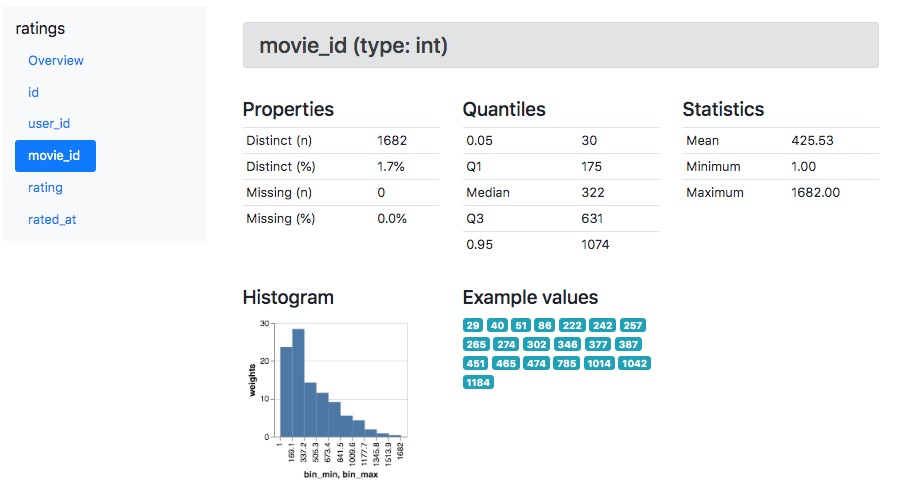
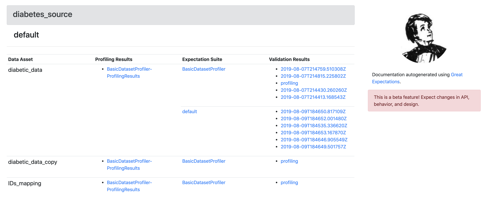

Data Docs compile Great Expectations objects such as Expectations and Validations into structured, formatted documents.
In these documents, they attempt to capture the key characteristics of a dataset.

One example of Data Docs is HTML documentation, which takes Expectation Suites and Validation Results and produces
clear, functional, and self-updating documentation of expected and observed data characteristics. Together with
profiling, it can help to rapidly create a clearer picture of your data, and keep your entire team on the same page as
data evolves.

For example, the default `BasicDatasetProfiler` in Great Expectations will produce Validation Results which compile to a
page for each table or DataFrame including an overview section:

And then detailed statistics for each column:

The Great Expectations Data Context uses a configurable "data documentation site" to define which artifacts to compile
and how to render them as documentation. Multiple sites can be configured inside a project, each suitable for a
particular data documentation use case.

For example, we have identified three common use cases for using documentation in a data project. They are to:

1. Visualize all Great Expectations artifacts from the local repository of a project as HTML: Expectation Suites,
   Validation Results and profiling results.
1. Maintain a "shared source of truth" for a team working on a data project. Such documentation renders all the
   artifacts committed in the source control system (Expectation Suites and profiling results) and a continuously
   updating data quality report, built from a chronological list of validations by run id.
1. Share a spec of a dataset with a client or a partner. This is similar to API documentation in software development.
   This documentation would include profiling results of the dataset to give the reader a quick way to grasp what the
   data looks like, and one or more Expectation Suites that encode what is expected from the data to be considered
   valid.

To support these (and possibly other) use cases Great Expectations has a concept of "data documentation site". Multiple
sites can be configured inside a project, each suitable for a particular data documentation use case.

Here is an example of a site:

The behavior of a site is controlled by configuration in the Data Context's `great_expectations.yml` file.

Users can specify
* which Datasources to document (by default, all)
* whether to include Expectations, validations and profiling results sections
* where the Expectations and validations should be read from (filesystem, S3, or GCS)
* where the HTML files should be written (filesystem, S3, or GCS)
* which renderer and view class should be used to render each section

## Customizing HTML Documentation

The HTML documentation generated by Great Expectations Data Docs is fully customizable. If you would like to customize
the look and feel of these pages or create your own, see [Configuring Data Docs](/.).
